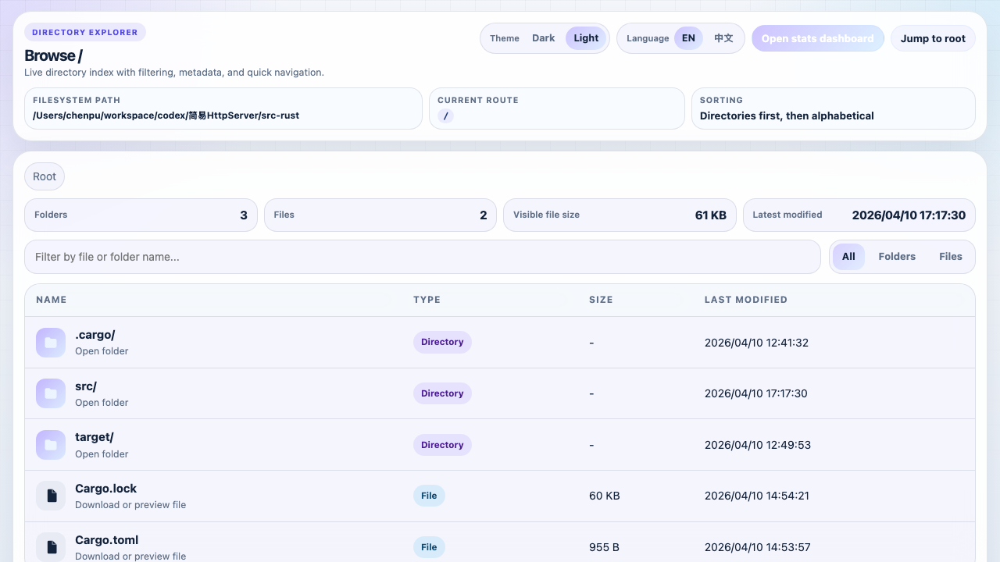
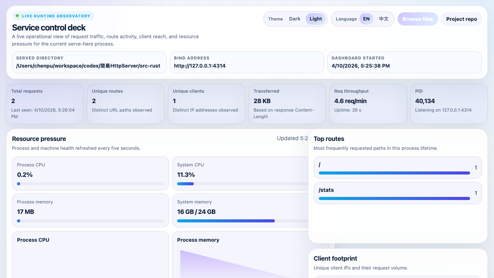
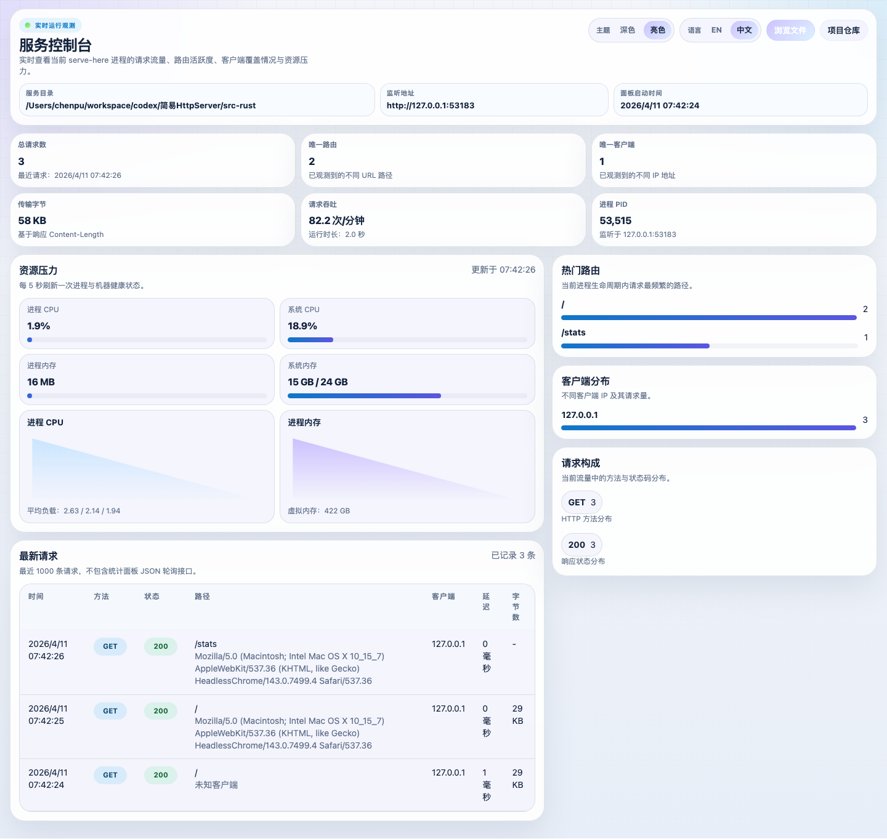
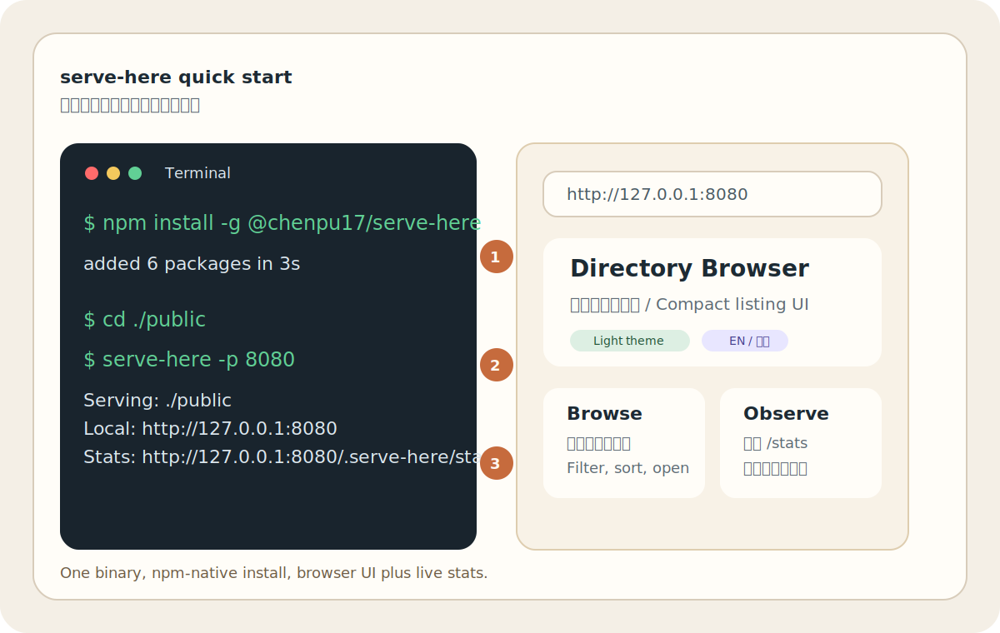

# serve-here

Serve any local directory over HTTP with a single command.
用一条命令把任意本地目录通过 HTTP 暴露出去。

> **v2.0.3**: Rust backend, native npm distribution, polished file browser, and built-in live stats dashboard.
>
> **v2.0.3**：Rust 后端、原生 npm 分发、精致目录浏览页，以及内置实时统计面板。

## Screenshots | 截图

### Directory Browser | 目录浏览页




### Stats Dashboard | 统计面板





## Features | 功能特点

- Instant static hosting for the current or specified directory.
  立即托管当前目录或指定目录。
- Clean directory browser with filtering, metadata, compact layout, and live navigation.
  精致目录浏览页，支持筛选、元数据展示、紧凑布局和快速导航。
- Light and dark themes, with bilingual English/Chinese UI toggles.
  支持亮色/深色主题，并可在中英文界面之间切换。
- Automatic `index.html` support plus safe redirects for non-ASCII paths.
  自动识别 `index.html`，并安全处理中文等非 ASCII 路径跳转。
- Built-in `/stats` dashboard with request volume, route heat, client footprint, and system/process resource charts.
  内置 `/stats` 运行状态面板，可查看请求量、热门路由、客户端分布，以及系统/进程资源图表。
- Native binary distribution via npm optional platform packages.
  通过 npm 可选平台包分发原生二进制文件。
- Multi-platform support: macOS (Intel/Apple Silicon), Linux (x64/ARM64), Windows (x64).
  多平台支持：macOS（Intel / Apple Silicon）、Linux（x64 / ARM64）、Windows（x64）。

## Installation | 安装

```sh
npm install -g @chenpu17/serve-here
```

Or run ad-hoc:
或者临时执行：

```sh
npx @chenpu17/serve-here
```

## Quick Start | 快速开始



1. Install globally, or skip install and use `npx`.
   全局安装，或者直接用 `npx` 临时运行。
2. Start the current directory with `serve-here -p 8080`.
   用 `serve-here -p 8080` 启动当前目录。
3. Open `http://127.0.0.1:8080` for the file browser, then visit `http://127.0.0.1:8080/.serve-here/stats` for live metrics.
   打开 `http://127.0.0.1:8080` 查看目录页，再访问 `http://127.0.0.1:8080/.serve-here/stats` 查看实时统计。

Typical commands:
常用命令：

```sh
# Run the current directory
serve-here

# Run a specific directory on a custom port
serve-here ./dist -p 9000

# Temporary run without global install
npx @chenpu17/serve-here ./public
```

## Usage | 使用方式

```sh
serve-here [options] [directory]
```

- `directory`: Directory to share; defaults to the current working directory.
  `directory`：要共享的目录，默认当前工作目录。
- `-d, --dir <path>`: Explicit directory override.
  `-d, --dir <path>`：显式指定共享目录。
- `-p, --port <number>`: Port to listen on (default `8080`).
  `-p, --port <number>`：监听端口，默认 `8080`。
- `-H, --host <address>`: Host/IP to bind (default `0.0.0.0`).
  `-H, --host <address>`：绑定主机或 IP，默认 `0.0.0.0`。
- `-D, --daemon`: Run as background daemon (Unix only).
  `-D, --daemon`：以守护进程运行（仅 Unix）。
- `--stop`: Stop a running daemon (use with `-p` to specify port).
  `--stop`：停止守护进程（可配合 `-p` 指定端口）。
- `--status`: Show status of running daemon(s).
  `--status`：查看守护进程状态。

After startup, the terminal prints accessible addresses. If the directory contains no `index.html`, the browser shows the built-in directory UI. Visit `/stats` for the runtime dashboard.
启动后终端会打印可访问地址。如果目录中没有 `index.html`，浏览器会显示内置目录 UI。访问 `/stats` 可打开运行状态面板。

## First-Time Experience | 首次使用体验

- The browser UI defaults to a compact, readable layout with fast directory navigation.
  浏览器 UI 默认采用紧凑、清晰的布局，适合快速浏览目录。
- Theme and language preferences persist across the directory page and stats dashboard.
  主题和语言偏好会在目录页与统计页之间保持同步。
- If an `index.html` exists, it is served directly; otherwise the built-in directory browser is shown.
  如果目录里存在 `index.html`，会直接打开该页面；否则展示内置目录浏览页。

## Development | 开发

Build and run locally:
本地构建与运行：

```sh
cd src-rust
cargo run -- /path/to/dir
```

Run Rust tests:
运行 Rust 测试：

```sh
cd src-rust
cargo test
```

Run E2E web UI tests:
运行 Web UI 端到端测试：

```sh
npx playwright test e2e/webui.spec.js --reporter=line
```

## Release Pipeline | 发布流水线

Tag-based release:
基于标签的发布：

```sh
./scripts/release-all.sh 2.0.3
```

Current GitHub Actions behavior:
当前 GitHub Actions 行为：

- `CI` runs `cargo check`, `cargo clippy`, `cargo test`, and release builds for all supported targets.
  `CI` 会执行 `cargo check`、`cargo clippy`、`cargo test`，并构建所有支持的平台目标。
- `CD` triggers on `v*.*.*` tags, verifies tests again, builds platform binaries, publishes platform-specific npm packages, then publishes the main npm package.
  `CD` 在 `v*.*.*` 标签触发，重新执行测试，构建平台二进制，先发布平台 npm 包，再发布主 npm 包。
- The GitHub Release body is generated from the repository script, so published notes follow the same structure as your local draft.
  GitHub Release 正文现在由仓库内脚本生成，因此线上发布说明与本地草稿结构保持一致。
- The workflow is versioned by semver tag, so npm will retain multiple released versions.
  工作流按语义化版本标签发布，因此 npm 会保留多个已发布版本。
- The npm distribution is multi-platform, not multi-channel: it publishes one main package plus per-platform packages.
  npm 分发是多平台的，不是多发布通道的：会发布一个主包和多个平台子包。
- Re-runs are idempotent for already-published versions: the workflow now skips packages that already exist on npm.
  对已发布版本可安全重跑：工作流现在会跳过 npm 上已经存在的版本。

If you need prerelease channels such as `beta` or `next`, add npm dist-tag logic on top of the current semver workflow.
如果需要 `beta`、`next` 之类的预发布通道，需要在当前语义化版本工作流之上再增加 npm dist-tag 逻辑。

For richer manual release notes, generate a draft locally:
如果需要更完整的手工版 release notes，可以先在本地生成草稿：

```sh
./scripts/prepare-release.sh 2.0.3
./scripts/generate-release-notes.sh v2.0.3 > /tmp/v2.0.3-release-notes.md
```

The draft format is documented in [docs/release-template.md](docs/release-template.md).
草稿格式说明见 [docs/release-template.md](docs/release-template.md)。

If you want one-command orchestration without pushing yet, use:
如果你想先一条命令演练但暂不推送，可以用：

```sh
./scripts/release-all.sh 2.0.3 --no-push
./scripts/release-all.sh 2.0.3 --dry-run
```
